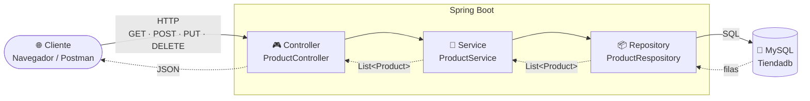
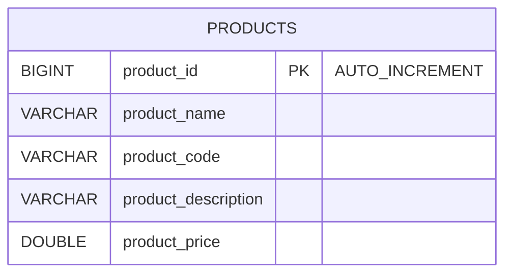

<div align="center">

# 🛒 Product API

### Mi primera API REST con Spring Boot


*Escuela Profesional Vedruna Sevilla · 2º DAM · Desarrollo de Aplicaciones Web. Microservicios*

</div>

---

> 🌿 **Estás en la rama `feature/Controllers`.** Respecto a `main` hemos añadido los endpoints que faltaban. Solo cambian **3 archivos**, uno por capa:
>
> | Archivo | Qué hemos añadido |
> |---------|-------------------|
> | `ProductService` | 4 métodos nuevos en el contrato: `getProductById`, `createProduct`, `updateProduct`, `deleteProduct`. |
> | `ProductServiceImpl` | La implementación de esos 4 métodos. |
> | `ProductController` | 4 endpoints nuevos (`GET /{id}`, `POST`, `PUT /{id}`, `DELETE /{id}`) y ahora devolvemos `ResponseEntity`. |
>
> 🔍 Para ver las diferencias exactas: `git diff main..feature/Controllers`, o comparando las dos ramas en GitHub.

---

## 📖 Índice

1. [¿Qué vamos a construir?](#-qué-vamos-a-construir)
2. [La arquitectura en capas](#️-la-arquitectura-en-capas)
3. [Estructura del proyecto](#-estructura-del-proyecto)
4. [Las dependencias (`pom.xml`)](#-las-dependencias-pomxml)
5. [La base de datos](#️-la-base-de-datos)
6. [La configuración (`application.yaml`)](#️-la-configuración-applicationyaml)
7. [El código, capa a capa](#-el-código-capa-a-capa)
8. [Cómo arrancar el proyecto](#-cómo-arrancar-el-proyecto)
9. [Probar la API](#-probar-la-api)
10. [Chuleta de anotaciones](#-chuleta-de-anotaciones)

---

## 🎯 ¿Qué vamos a construir?

Una **API REST** que se conecta a una base de datos **MySQL** y devuelve la lista de productos de una tienda en formato **JSON**.

```
GET http://localhost:8080/api/v1/products
```

```json
[
  {
    "productId": 1,
    "name": "Iphone 18 PRO Max",
    "price": 1319.0,
    "description": "Ultima version ya a la venta",
    "sku": "X4OS"
  }
]
```

Es un ejemplo pequeño, pero ya tiene **todas las piezas** que tendrá cualquier microservicio que hagamos durante el curso.

En la rama `feature/Controllers` la API ya hace un **CRUD completo**: listar, buscar por id, crear, modificar y borrar productos.

---

## 🏗️ La arquitectura en capas

Cada capa tiene **una sola responsabilidad** y solo habla con la capa que tiene justo debajo.



| Capa | Pregunta que responde | Clase |
|------|----------------------|-------|
| 🎮 **Controller** | *¿Qué URL me han pedido y qué devuelvo?* | `ProductController` |
| 🧠 **Service** | *¿Qué lógica de negocio hay que aplicar?* | `ProductService` / `ProductServiceImpl` |
| 📦 **Repository** | *¿Cómo leo y guardo en la base de datos?* | `ProductRespository` |
| 🧱 **Model** | *¿Cómo es un producto?* | `Product` |

> 💡 **¿Por qué tantas capas para algo tan simple?** Porque cuando el proyecto crezca (validaciones, seguridad, varias tablas...), cada cosa tendrá su sitio y el código seguirá siendo fácil de entender y de cambiar.

---

## 📁 Estructura del proyecto

```
product/
├── 📄 pom.xml                          ← Dependencias (Maven)
├── 📄 mvnw / mvnw.cmd                  ← Maven Wrapper (no hace falta instalar Maven)
└── src/
    ├── main/
    │   ├── java/com/vedrunaSevilla/product/
    │   │   ├── 🚀 ProductApplication.java       ← Punto de entrada
    │   │   ├── controller/
    │   │   │   └── ProductController.java       ← Capa web (endpoints)
    │   │   ├── service/
    │   │   │   ├── ProductService.java          ← Interfaz (el "qué")
    │   │   │   └── ProductServiceImpl.java      ← Implementación (el "cómo")
    │   │   └── persistance/
    │   │       ├── model/
    │   │       │   └── Product.java             ← Entidad (tabla products)
    │   │       └── repository/
    │   │           └── ProductRespository.java  ← Acceso a datos
    │   └── resources/
    │       ├── ⚙️ application.yaml              ← Configuración
    │       └── db/
    │           ├── db.sql                       ← Crea la tabla
    │           └── data.sql                     ← Datos de ejemplo
    └── test/
        └── .../ProductApplicationTests.java
```

---

## 📦 Las dependencias (`pom.xml`)

| Dependencia | ¿Para qué sirve? |
|-------------|------------------|
| `spring-boot-starter-webmvc` | Crear la API REST y levantar un servidor **Tomcat** embebido en el puerto `8080`. |
| `spring-boot-starter-data-jpa` | Trabajar con la base de datos usando **objetos Java** en vez de escribir SQL a mano (JPA + Hibernate). |
| `mysql-connector-j` | El **driver** que permite a Java hablar con MySQL. |
| `lombok` | Genera automáticamente getters, setters, constructores... ¡Menos código repetitivo! |
| `spring-boot-devtools` | Reinicia la aplicación sola cuando guardamos cambios. |
| `*-test` | Herramientas para hacer tests (las veremos más adelante). |

> ⚠️ **Lombok** necesita que tu IDE tenga la extensión/plugin instalado (en VS Code viene con el *Extension Pack for Java*; en IntelliJ viene de serie).

---

## 🗄️ La base de datos

Tenemos una única tabla, `products`, dentro de la base de datos `Tiendadb`.



**`db/db.sql`** — crea la tabla:

```sql
CREATE TABLE Tiendadb.products (
    product_id BIGINT AUTO_INCREMENT PRIMARY KEY,
    product_name VARCHAR(255),
    product_code VARCHAR(255),
    product_description VARCHAR(255),
    product_price DOUBLE
);
```

**`db/data.sql`** — inserta un producto de prueba:

```sql
INSERT INTO Tiendadb.products (product_name, product_code, product_description, product_price)
VALUES ('Iphone 18 PRO Max', 'X4OS', 'Ultima version ya a la venta', 1319.00);
```

---

## ⚙️ La configuración (`application.yaml`)

```yaml
spring:
  application:
    name: Producto
  datasource:
    url: jdbc:mysql://localhost:3306/Tiendadb?createDatabaseIfNotExist=true&...
    username: root
    password: TU_CONTRASEÑA
    driver-class-name: com.mysql.cj.jdbc.Driver
  jpa:
    hibernate:
      ddl-auto: none
```

| Propiedad | Significado |
|-----------|-------------|
| `datasource.url` | Dónde está la BD: MySQL en `localhost`, puerto `3306`, base de datos `Tiendadb`. |
| `createDatabaseIfNotExist=true` | Si la base de datos no existe, la crea al arrancar. |
| `username` / `password` | Credenciales de **tu** MySQL. ✏️ ¡Cámbialas por las tuyas! |
| `ddl-auto: none` | Hibernate **no toca** las tablas: las creamos nosotros con nuestros scripts SQL. |

---

## 🧩 El código, capa a capa

### 🚀 1. El punto de entrada — `ProductApplication`

```java
@SpringBootApplication
public class ProductApplication {
    public static void main(String[] args) {
        SpringApplication.run(ProductApplication.class, args);
    }
}
```

`@SpringBootApplication` le dice a Spring: *"arranca aquí, configura todo automáticamente y busca mis clases (`@Service`, `@RestController`...) en este paquete y sus subpaquetes"*.

---

### 🧱 2. El modelo — `Product`

Una **entidad** es una clase Java que representa una **tabla** de la base de datos. Cada objeto `Product` es una **fila**.

```java
@Entity
@Table(name = "products")
@NoArgsConstructor
@Data
public class Product {

    @Id
    @Column(name = "product_id")
    @GeneratedValue(strategy = GenerationType.IDENTITY)
    private Long productId;

    @Column(name = "product_name")
    private String name;

    @Column(name = "product_price")
    private double price;

    @Column(name = "product_description")
    private String description;

    @Column(name = "product_code")
    private String sku;
}
```

🔗 **Mapeo tabla ↔ clase:**

| Columna en MySQL | Atributo en Java | Nombre en el JSON |
|------------------|------------------|-------------------|
| `product_id` | `productId` | `"productId"` |
| `product_name` | `name` | `"name"` |
| `product_price` | `price` | `"price"` |
| `product_description` | `description` | `"description"` |
| `product_code` | `sku` | `"sku"` |

> 💡 Fíjate: gracias a `@Column(name = ...)` el atributo en Java **no tiene por qué llamarse igual** que la columna. Por ejemplo, `product_code` en la BD es `sku` en Java. Y el JSON usa el nombre del **atributo Java**, no el de la columna.

---

### 📦 3. El repositorio — `ProductRespository`

```java
public interface ProductRespository extends JpaRepository<Product, Long> {
}
```

¡Una interfaz **vacía**... y ya funciona! 🪄

Al extender `JpaRepository<Product, Long>` (entidad, tipo del id), Spring Data JPA nos **regala** un montón de métodos sin escribir ni una línea:

| Método | SQL equivalente |
|--------|-----------------|
| `findAll()` | `SELECT * FROM products` |
| `findById(id)` | `SELECT * FROM products WHERE product_id = ?` |
| `save(product)` | `INSERT ...` o `UPDATE ...` |
| `deleteById(id)` | `DELETE FROM products WHERE product_id = ?` |
| `count()` | `SELECT COUNT(*) FROM products` |

---

### 🧠 4. El servicio — `ProductService` + `ProductServiceImpl`

Separamos el **contrato** (interfaz) de la **implementación**:

```java
public interface ProductService {
    public List<Product> getAllProducts();
    public Product getProductById(Long id);
    public Product createProduct(Product product);
    public Product updateProduct(Long id, Product product);
    public void deleteProduct(Long id);
}
```

```java
@Service
@AllArgsConstructor
public class ProductServiceImpl implements ProductService {

    ProductRespository productRespository;

    @Override
    public List<Product> getAllProducts() {
        return productRespository.findAll();
    }

    @Override
    public Product getProductById(Long id) {
        return productRespository.findById(id)
                .orElseThrow(() -> new RuntimeException("Product not found with id: " + id));
    }

    @Override
    public Product createProduct(Product product) {
        return productRespository.save(product);
    }

    @Override
    public Product updateProduct(Long id, Product product) {
        Product existingProduct = productRespository.findById(id)
                .orElseThrow(() -> new RuntimeException("Product not found with id: " + id));
        existingProduct.setName(product.getName());
        existingProduct.setDescription(product.getDescription());
        existingProduct.setPrice(product.getPrice());
        return productRespository.save(existingProduct);
    }

    @Override
    public void deleteProduct(Long id) {
        Product existingProduct = productRespository.findById(id)
                .orElseThrow(() -> new RuntimeException("Product not found with id: " + id));
        productRespository.delete(existingProduct);
    }
}
```

- `@Service` → Spring crea un objeto de esta clase y lo gestiona él (es un **bean**).
- `@AllArgsConstructor` → Lombok genera un constructor con el repositorio como parámetro, y Spring lo usa para **inyectarlo** automáticamente.

**¿Qué hace cada método?**

| Método | Qué hace |
|--------|----------|
| `getAllProducts()` | Devuelve todos los productos con `findAll()`. |
| `getProductById(id)` | Busca con `findById(id)`. Devuelve un `Optional`: si el producto existe lo entrega y, si no, `orElseThrow` lanza una excepción. |
| `createProduct(product)` | Guarda el producto con `save()`. Como no trae `productId`, la BD le asigna uno nuevo (`INSERT`). |
| `updateProduct(id, product)` | **Primero busca** el producto que ya existe, **le cambia** `name`, `description` y `price` con los valores recibidos y lo guarda (`UPDATE`). |
| `deleteProduct(id)` | Busca el producto (si no existe falla) y lo borra con `delete()`. |

> 🔎 **Fíjate en `updateProduct`:** no guardamos directamente el `product` que llega, sino que modificamos el `existingProduct` que acabamos de leer de la BD. Así nos aseguramos de que el id es el de la URL y de que solo tocamos los campos que queremos.

> 💉 **Inyección de dependencias:** nosotros **nunca** hacemos `new ProductRespository()`. Declaramos lo que necesitamos y Spring nos lo da ya creado. A esto se le llama *Inversión de Control (IoC)*.

---

### 🎮 5. El controlador — `ProductController`

```java
@RestController
@RequestMapping("/api/v1/products")
@CrossOrigin
@AllArgsConstructor
public class ProductController {

    ProductService productService;

    @GetMapping
    public ResponseEntity<List<Product>> getAllProducts() {
        return ResponseEntity.ok(productService.getAllProducts());
    }

    @GetMapping("/{id}")
    public ResponseEntity<Product> getProductById(@PathVariable Long id) {
        return ResponseEntity.ok(productService.getProductById(id));
    }

    @PostMapping
    public ResponseEntity<Product> createProduct(@RequestBody Product product) {
        return ResponseEntity.ok(productService.createProduct(product));
    }

    @PutMapping("/{id}")
    public ResponseEntity<Product> updateProduct(@PathVariable Long id, @RequestBody Product product) {
        return ResponseEntity.ok(productService.updateProduct(id, product));
    }

    @DeleteMapping("/{id}")
    public ResponseEntity<Void> deleteProduct(@PathVariable Long id) {
        productService.deleteProduct(id);
        return ResponseEntity.noContent().build();
    }
}
```

- `@RestController` → esta clase atiende peticiones HTTP y lo que devuelve se convierte **automáticamente a JSON**.
- `@RequestMapping("/api/v1/products")` → la URL base de todos sus endpoints.
- `@GetMapping` → este método responde a peticiones **GET** en esa URL.
- `@PostMapping` → responde a peticiones **POST** (crear).
- `@PutMapping("/{id}")` → responde a peticiones **PUT** (modificar). El `{id}` es una parte variable de la URL.
- `@DeleteMapping("/{id}")` → responde a peticiones **DELETE** (borrar).
- `@PathVariable` → recoge el valor de `{id}` de la URL y lo mete en el parámetro. En `/api/v1/products/3`, `id` vale `3`.
- `@RequestBody` → coge el **JSON** que viene en el cuerpo de la petición y lo convierte en un objeto `Product`.
- `@CrossOrigin` → permite que un frontend alojado en otro dominio/puerto (por ejemplo, Angular o React) pueda llamar a la API (**CORS**).

#### 📬 `ResponseEntity`: controlar la respuesta HTTP

Antes devolvíamos directamente la lista. Ahora devolvemos un `ResponseEntity<T>`, que nos deja decidir **el código de estado HTTP** además del cuerpo:

| Código | Cuándo lo usamos |
|:------:|------------------|
| `200 OK` | `ResponseEntity.ok(...)` → la petición fue bien y devolvemos datos. |
| `204 No Content` | `ResponseEntity.noContent().build()` → el borrado fue bien y **no hay nada que devolver** (por eso el tipo es `ResponseEntity<Void>`). |

> 💡 Fíjate en que el controlador depende de la **interfaz** `ProductService`, no de `ProductServiceImpl`. Si mañana cambiamos la implementación, el controlador ni se entera.

---

## 🚀 Cómo arrancar el proyecto

### ✅ Requisitos

- ☕ **JDK 17** o superior
- 🐬 **MySQL** en marcha en `localhost:3306`
- 🧰 Un IDE: VS Code (con *Extension Pack for Java* + *Spring Boot Extension Pack*) o IntelliJ IDEA

### 1️⃣ Prepara la base de datos

Abre MySQL Workbench (o la consola de MySQL) y ejecuta:

```sql
CREATE DATABASE IF NOT EXISTS Tiendadb;
```

Después ejecuta, **en este orden**, los scripts:

1. `src/main/resources/db/db.sql` → crea la tabla
2. `src/main/resources/db/data.sql` → mete el producto de prueba

### 2️⃣ Configura tus credenciales

Edita `src/main/resources/application.yaml` y pon **tu** usuario y contraseña de MySQL:

```yaml
    username: root
    password: TU_CONTRASEÑA
```

### 3️⃣ Arranca la aplicación

Desde el IDE, pulsa ▶️ **Run** sobre `ProductApplication.java`, o desde la terminal:

```bash
# macOS / Linux
./mvnw spring-boot:run

# Windows
mvnw.cmd spring-boot:run
```

Si todo va bien, verás en la consola algo parecido a:

```
Tomcat started on port 8080 (http) with context path '/'
Started ProductApplication in 2.345 seconds
```

---

## 🧪 Probar la API

| Método | Endpoint | Descripción |
|:------:|----------|-------------|
|  | `/api/v1/products` | Devuelve todos los productos |
|  | `/api/v1/products/{id}` | Devuelve el producto con ese id |
|  | `/api/v1/products` | Crea un producto nuevo |
|  | `/api/v1/products/{id}` | Modifica el producto con ese id |
|  | `/api/v1/products/{id}` | Borra el producto con ese id |

**Opción A — Navegador 🌐**

Abre 👉 [http://localhost:8080/api/v1/products](http://localhost:8080/api/v1/products)

**Opción B — Terminal 💻**

```bash
curl http://localhost:8080/api/v1/products
```

**Opción C — Postman / Thunder Client 📮**

Crea una petición `GET` a `http://localhost:8080/api/v1/products` y pulsa **Send**.

> 🌐 El navegador solo sabe hacer `GET`. Para probar `POST`, `PUT` y `DELETE` usa **Postman**, **Thunder Client** o `curl`.

### ➕ Crear un producto (`POST`)

En el cuerpo (*Body → raw → JSON*) mandamos el producto **sin `productId`**: lo genera la base de datos.

```bash
curl -X POST http://localhost:8080/api/v1/products \
  -H "Content-Type: application/json" \
  -d '{"name": "Airpods Pro", "price": 279.0, "description": "Cancelación de ruido", "sku": "AP01"}'
```

Respuesta `200 OK` con el producto ya guardado y su `productId`.

### ✏️ Modificar un producto (`PUT`)

El id va en la **URL** y los nuevos datos en el **cuerpo**:

```bash
curl -X PUT http://localhost:8080/api/v1/products/1 \
  -H "Content-Type: application/json" \
  -d '{"name": "Iphone 18 PRO Max", "price": 1199.0, "description": "Rebajado"}'
```

Se actualizan `name`, `description` y `price`.

### 🗑️ Borrar un producto (`DELETE`)

```bash
curl -X DELETE http://localhost:8080/api/v1/products/1
```

Respuesta `204 No Content`: se ha borrado y no hay cuerpo.

### 🔍 Buscar uno por id (`GET /{id}`)

```bash
curl http://localhost:8080/api/v1/products/1
```

---

## 📝 Chuleta de anotaciones

| Anotación | Dónde | ¿Qué hace? |
|-----------|-------|------------|
| `@SpringBootApplication` | Clase principal | Arranca y autoconfigura Spring Boot |
| `@RestController` | Controller | Clase que atiende HTTP y responde JSON |
| `@RequestMapping` | Controller | Ruta base de la clase |
| `@GetMapping` | Método | Responde a peticiones GET |
| `@PostMapping` | Método | Responde a peticiones POST (crear) |
| `@PutMapping` | Método | Responde a peticiones PUT (modificar) |
| `@DeleteMapping` | Método | Responde a peticiones DELETE (borrar) |
| `@PathVariable` | Parámetro | Recoge un valor de la URL (`/{id}`) |
| `@RequestBody` | Parámetro | Convierte el JSON del cuerpo en un objeto Java |
| `@CrossOrigin` | Controller | Habilita CORS |
| `@Service` | Service | Marca la clase como bean de lógica de negocio |
| `@Entity` | Model | La clase representa una tabla |
| `@Table` | Model | Nombre de la tabla |
| `@Id` | Atributo | Clave primaria |
| `@GeneratedValue` | Atributo | El id lo genera la BD (AUTO_INCREMENT) |
| `@Column` | Atributo | Nombre de la columna |
| `@Data` 🌶️ | Model | *(Lombok)* getters, setters, `toString`, `equals`, `hashCode` |
| `@NoArgsConstructor` 🌶️ | Model | *(Lombok)* constructor vacío (JPA lo necesita) |
| `@AllArgsConstructor` 🌶️ | Controller / Service | *(Lombok)* constructor con todos los atributos → inyección de dependencias |

---

## 🔜 Próximamente...

- [x] Listar todos los productos (`GET`)
- [x] Buscar un producto por id (`GET /{id}`)
- [x] Crear un producto (`POST`)
- [x] Modificar un producto (`PUT`)
- [x] Borrar un producto (`DELETE`)
- [ ] Devolver `404 Not Found` cuando el producto no existe (ahora lanzamos una `RuntimeException` genérica, que acaba en un `500`)
- [ ] Devolver `201 Created` al crear un producto
- [ ] Validar los datos de entrada (nombre obligatorio, precio positivo...)

---

<div align="center">

Hecho con ☕ y 💚 en **Vedruna Sevilla**

</div>
