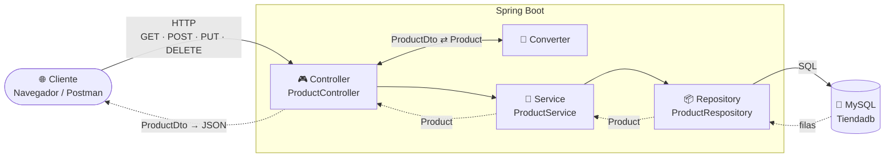
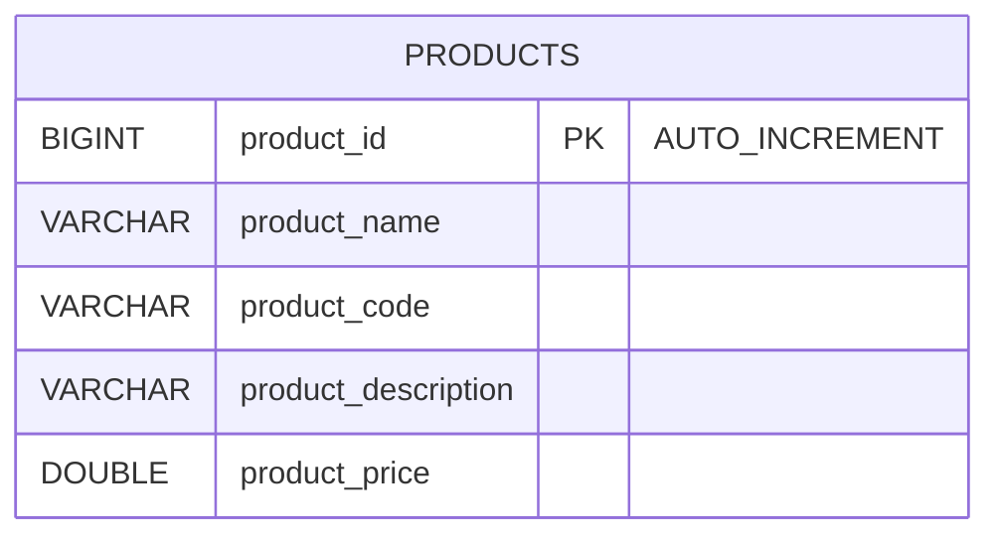
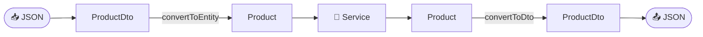

<div align="center">

# 🛒 Product API

### Mi primera API REST con Spring Boot


*Escuela Profesional Vedruna Sevilla · 2º DAM · Desarrollo de Aplicaciones Web. Microservicios*

</div>

---

> 🌿 **Estás en la rama `feature/dto-converter-response`.** Sale de `develop` (que ya tiene el CRUD de `feature/Controllers`) y trae dos novedades:
>
> 1. 📨 Los controladores ya **no devuelven la entidad** `Product`, sino un **DTO** (`ProductDto`).
> 2. 🚦 Los endpoints devuelven el **código de estado HTTP correcto** (`201`, `404`...).
>
> | Archivo | Qué ha cambiado |
> |---------|-----------------|
> | 🆕 `controller/dto/ProductDto` | Clase nueva: los datos del producto que **viajan por la API**. |
> | 🆕 `controller/converter/Converter` | Clase nueva: convierte `Product` ⇄ `ProductDto`. |
> | ✏️ `ProductController` | Recibe y devuelve `ProductDto`, usa el `Converter` y devuelve `201 Created` y `404 Not Found`. |
> | ✏️ `ProductServiceImpl` | `getProductById` devuelve `null` si no existe, en lugar de lanzar una excepción. |
>
> 🔍 Para ver las diferencias exactas: `git diff develop..feature/dto-converter-response`, o comparando las dos ramas en GitHub.

---------|-------------------|
> | `ProductService` | 4 métodos nuevos en el contrato: `getProductById`, `createProduct`, `updateProduct`, `deleteProduct`. |
> | `ProductServiceImpl` | La implementación de esos 4 métodos. |
> | `ProductController` | 4 endpoints nuevos (`GET /{id}`, `POST`, `PUT /{id}`, `DELETE /{id}`) y ahora devolvemos `ResponseEntity`. |
>
> 🔍 Para ver las diferencias exactas: `git diff main..feature/Controllers`, o comparando las dos ramas en GitHub.

---

## 📖 Índice

1. [¿Qué vamos a construir?](#-qué-vamos-a-construir)
2. [La arquitectura en capas](#️-la-arquitectura-en-capas)
3. [Estructura del proyecto](#-estructura-del-proyecto)
4. [Las dependencias (`pom.xml`)](#-las-dependencias-pomxml)
5. [La base de datos](#️-la-base-de-datos)
6. [La configuración (`application.yaml`)](#️-la-configuración-applicationyaml)
7. [El código, capa a capa](#-el-código-capa-a-capa)
8. [Cómo arrancar el proyecto](#-cómo-arrancar-el-proyecto)
9. [Probar la API](#-probar-la-api)
10. [Chuleta de anotaciones](#-chuleta-de-anotaciones)

---

## 🎯 ¿Qué vamos a construir?

Una **API REST** que se conecta a una base de datos **MySQL** y devuelve la lista de productos de una tienda en formato **JSON**.

```
GET http://localhost:8080/api/v1/products
```

```json
[
  {
    "name": "Iphone 18 PRO Max",
    "price": 1319.0,
    "description": "Ultima version ya a la venta",
    "sku": "X4OS"
  }
]
```

Es un ejemplo pequeño, pero ya tiene **todas las piezas** que tendrá cualquier microservicio que hagamos durante el curso.

La API ya hace un **CRUD completo**: listar, buscar por id, crear, modificar y borrar productos. Y en esta rama, además, lo que entra y sale por la API es un **DTO**, no la entidad.

---

## 🏗️ La arquitectura en capas

Cada capa tiene **una sola responsabilidad** y solo habla con la capa que tiene justo debajo.



| Capa | Pregunta que responde | Clase |
|------|----------------------|-------|
| 🎮 **Controller** | *¿Qué URL me han pedido y qué devuelvo?* | `ProductController` |
| 📨 **DTO** | *¿Qué datos enseño al exterior?* | `ProductDto` |
| 🔄 **Converter** | *¿Cómo paso de entidad a DTO y viceversa?* | `Converter` |
| 🧠 **Service** | *¿Qué lógica de negocio hay que aplicar?* | `ProductService` / `ProductServiceImpl` |
| 📦 **Repository** | *¿Cómo leo y guardo en la base de datos?* | `ProductRespository` |
| 🧱 **Model** | *¿Cómo es un producto?* | `Product` |

> 🧭 **Regla de esta rama:** la entidad `Product` se queda **dentro** de la aplicación (Service y Repository). Hacia fuera (Controller ⇄ Cliente) solo viaja `ProductDto`.

> 💡 **¿Por qué tantas capas para algo tan simple?** Porque cuando el proyecto crezca (validaciones, seguridad, varias tablas...), cada cosa tendrá su sitio y el código seguirá siendo fácil de entender y de cambiar.

---

## 📁 Estructura del proyecto

```
product/
├── 📄 pom.xml                          ← Dependencias (Maven)
├── 📄 mvnw / mvnw.cmd                  ← Maven Wrapper (no hace falta instalar Maven)
└── src/
    ├── main/
    │   ├── java/com/vedrunaSevilla/product/
    │   │   ├── 🚀 ProductApplication.java       ← Punto de entrada
    │   │   ├── controller/
    │   │   │   ├── ProductController.java       ← Capa web (endpoints)
    │   │   │   ├── converter/
    │   │   │   │   └── Converter.java           ← 🆕 Product ⇄ ProductDto
    │   │   │   └── dto/
    │   │   │       └── ProductDto.java          ← 🆕 Lo que viaja por la API
    │   │   ├── service/
    │   │   │   ├── ProductService.java          ← Interfaz (el "qué")
    │   │   │   └── ProductServiceImpl.java      ← Implementación (el "cómo")
    │   │   └── persistance/
    │   │       ├── model/
    │   │       │   └── Product.java             ← Entidad (tabla products)
    │   │       └── repository/
    │   │           └── ProductRespository.java  ← Acceso a datos
    │   └── resources/
    │       ├── ⚙️ application.yaml              ← Configuración
    │       └── db/
    │           ├── db.sql                       ← Crea la tabla
    │           └── data.sql                     ← Datos de ejemplo
    └── test/
        └── .../ProductApplicationTests.java
```

---

## 📦 Las dependencias (`pom.xml`)

| Dependencia | ¿Para qué sirve? |
|-------------|------------------|
| `spring-boot-starter-webmvc` | Crear la API REST y levantar un servidor **Tomcat** embebido en el puerto `8080`. |
| `spring-boot-starter-data-jpa` | Trabajar con la base de datos usando **objetos Java** en vez de escribir SQL a mano (JPA + Hibernate). |
| `mysql-connector-j` | El **driver** que permite a Java hablar con MySQL. |
| `lombok` | Genera automáticamente getters, setters, constructores... ¡Menos código repetitivo! |
| `spring-boot-devtools` | Reinicia la aplicación sola cuando guardamos cambios. |
| `*-test` | Herramientas para hacer tests (las veremos más adelante). |

> ⚠️ **Lombok** necesita que tu IDE tenga la extensión/plugin instalado (en VS Code viene con el *Extension Pack for Java*; en IntelliJ viene de serie).

---

## 🗄️ La base de datos

Tenemos una única tabla, `products`, dentro de la base de datos `Tiendadb`.



**`db/db.sql`** — crea la tabla:

```sql
CREATE TABLE Tiendadb.products (
    product_id BIGINT AUTO_INCREMENT PRIMARY KEY,
    product_name VARCHAR(255),
    product_code VARCHAR(255),
    product_description VARCHAR(255),
    product_price DOUBLE
);
```

**`db/data.sql`** — inserta un producto de prueba:

```sql
INSERT INTO Tiendadb.products (product_name, product_code, product_description, product_price)
VALUES ('Iphone 18 PRO Max', 'X4OS', 'Ultima version ya a la venta', 1319.00);
```

---

## ⚙️ La configuración (`application.yaml`)

```yaml
spring:
  application:
    name: Producto
  datasource:
    url: jdbc:mysql://localhost:3306/Tiendadb?createDatabaseIfNotExist=true&...
    username: root
    password: TU_CONTRASEÑA
    driver-class-name: com.mysql.cj.jdbc.Driver
  jpa:
    hibernate:
      ddl-auto: none
```

| Propiedad | Significado |
|-----------|-------------|
| `datasource.url` | Dónde está la BD: MySQL en `localhost`, puerto `3306`, base de datos `Tiendadb`. |
| `createDatabaseIfNotExist=true` | Si la base de datos no existe, la crea al arrancar. |
| `username` / `password` | Credenciales de **tu** MySQL. ✏️ ¡Cámbialas por las tuyas! |
| `ddl-auto: none` | Hibernate **no toca** las tablas: las creamos nosotros con nuestros scripts SQL. |

---

## 🧩 El código, capa a capa

### 🚀 1. El punto de entrada — `ProductApplication`

```java
@SpringBootApplication
public class ProductApplication {
    public static void main(String[] args) {
        SpringApplication.run(ProductApplication.class, args);
    }
}
```

`@SpringBootApplication` le dice a Spring: *"arranca aquí, configura todo automáticamente y busca mis clases (`@Service`, `@RestController`...) en este paquete y sus subpaquetes"*.

---

### 🧱 2. El modelo — `Product`

Una **entidad** es una clase Java que representa una **tabla** de la base de datos. Cada objeto `Product` es una **fila**.

```java
@Entity
@Table(name = "products")
@NoArgsConstructor
@Data
public class Product {

    @Id
    @Column(name = "product_id")
    @GeneratedValue(strategy = GenerationType.IDENTITY)
    private Long productId;

    @Column(name = "product_name")
    private String name;

    @Column(name = "product_price")
    private double price;

    @Column(name = "product_description")
    private String description;

    @Column(name = "product_code")
    private String sku;
}
```

🔗 **Mapeo tabla ↔ clase:**

| Columna en MySQL | Atributo en `Product` | Atributo en `ProductDto` | Nombre en el JSON |
|------------------|-----------------------|--------------------------|-------------------|
| `product_id` | `productId` | — | — |
| `product_name` | `name` | `name` | `"name"` |
| `product_price` | `price` | `price` | `"price"` |
| `product_description` | `description` | `description` | `"description"` |
| `product_code` | `sku` | `sku` | `"sku"` |

> 💡 Fíjate: gracias a `@Column(name = ...)` el atributo en Java **no tiene por qué llamarse igual** que la columna. Por ejemplo, `product_code` en la BD es `sku` en Java. Y ahora el JSON usa los nombres de los atributos del **DTO**: como `ProductDto` no tiene `productId`, el id ya no aparece en las respuestas.

---

### 📦 3. El repositorio — `ProductRespository`

```java
public interface ProductRespository extends JpaRepository<Product, Long> {
}
```

¡Una interfaz **vacía**... y ya funciona! 🪄

Al extender `JpaRepository<Product, Long>` (entidad, tipo del id), Spring Data JPA nos **regala** un montón de métodos sin escribir ni una línea:

| Método | SQL equivalente |
|--------|-----------------|
| `findAll()` | `SELECT * FROM products` |
| `findById(id)` | `SELECT * FROM products WHERE product_id = ?` |
| `save(product)` | `INSERT ...` o `UPDATE ...` |
| `deleteById(id)` | `DELETE FROM products WHERE product_id = ?` |
| `count()` | `SELECT COUNT(*) FROM products` |

---

### 🧠 4. El servicio — `ProductService` + `ProductServiceImpl`

Separamos el **contrato** (interfaz) de la **implementación**:

```java
public interface ProductService {
    public List<Product> getAllProducts();
    public Product getProductById(Long id);
    public Product createProduct(Product product);
    public Product updateProduct(Long id, Product product);
    public void deleteProduct(Long id);
}
```

```java
@Service
@AllArgsConstructor
public class ProductServiceImpl implements ProductService {

    ProductRespository productRespository;

    @Override
    public List<Product> getAllProducts() {
        return productRespository.findAll();
    }

    @Override
    public Product getProductById(Long id) {
        return productRespository.findById(id).orElse(null);
    }

    @Override
    public Product createProduct(Product product) {
        return productRespository.save(product);
    }

    @Override
    public Product updateProduct(Long id, Product product) {
        Product existingProduct = productRespository.findById(id)
                .orElseThrow(() -> new RuntimeException("Product not found with id: " + id));
        existingProduct.setName(product.getName());
        existingProduct.setDescription(product.getDescription());
        existingProduct.setPrice(product.getPrice());
        return productRespository.save(existingProduct);
    }

    @Override
    public void deleteProduct(Long id) {
        Product existingProduct = productRespository.findById(id)
                .orElseThrow(() -> new RuntimeException("Product not found with id: " + id));
        productRespository.delete(existingProduct);
    }
}
```

- `@Service` → Spring crea un objeto de esta clase y lo gestiona él (es un **bean**).
- `@AllArgsConstructor` → Lombok genera un constructor con el repositorio como parámetro, y Spring lo usa para **inyectarlo** automáticamente.

**¿Qué hace cada método?**

| Método | Qué hace |
|--------|----------|
| `getAllProducts()` | Devuelve todos los productos con `findAll()`. |
| `getProductById(id)` | Busca con `findById(id)`, que devuelve un `Optional`. Si el producto existe lo entrega y, si no, `orElse(null)` devuelve `null`. ✏️ *Cambiado en esta rama*: antes lanzaba una excepción y ahora es el **controlador** quien decide responder `404`. |
| `createProduct(product)` | Guarda el producto con `save()`. Como no trae `productId`, la BD le asigna uno nuevo (`INSERT`). |
| `updateProduct(id, product)` | **Primero busca** el producto que ya existe, **le cambia** `name`, `description` y `price` con los valores recibidos y lo guarda (`UPDATE`). |
| `deleteProduct(id)` | Busca el producto (si no existe falla) y lo borra con `delete()`. |

> 🔎 **Fíjate en `updateProduct`:** no guardamos directamente el `product` que llega, sino que modificamos el `existingProduct` que acabamos de leer de la BD. Así nos aseguramos de que el id es el de la URL y de que solo tocamos los campos que queremos.

> 💉 **Inyección de dependencias:** nosotros **nunca** hacemos `new ProductRespository()`. Declaramos lo que necesitamos y Spring nos lo da ya creado. A esto se le llama *Inversión de Control (IoC)*.

---

### 📨 5. El DTO — `ProductDto` 🆕

Un **DTO** (*Data Transfer Object*) es una clase sencilla que solo sirve para **transportar datos** entre el cliente y nuestra API. Es lo que el cliente **ve** y lo que el cliente **manda**.

```java
@Data
public class ProductDto {

    private String name;

    private double price;

    private String description;

    private String sku;
}
```

Solo tiene `@Data` de Lombok: **nada de JPA** (ni `@Entity`, ni `@Id`, ni `@Column`). No sabe nada de la base de datos.

**¿Por qué no devolvemos directamente la entidad `Product`?**

| Sin DTO (devolviendo `Product`) | Con DTO (devolviendo `ProductDto`) |
|---------------------------------|------------------------------------|
| Enseñamos **cómo es nuestra tabla** por dentro | Enseñamos solo lo que **queremos** enseñar |
| Si cambiamos la BD, **cambia el JSON** y rompemos a los clientes | La BD puede cambiar y el JSON **sigue igual** |
| El cliente podría mandar campos que no debería tocar (por ejemplo, el id) | El cliente solo puede mandar los campos del DTO |
| Imposible ocultar datos sensibles (contraseñas, campos internos...) | Basta con **no ponerlos** en el DTO |

> 🍽️ **Analogía:** la entidad es la **cocina** del restaurante y el DTO es el **plato** que llega a la mesa. El cliente no necesita ver la cocina.

---

### 🔄 6. El conversor — `Converter` 🆕

Alguien tiene que **pasar los datos** de `Product` a `ProductDto` y al revés. De eso se encarga el `Converter`:

```java
@Component
public class Converter {

    public ProductDto convertToDto(Product product) {
        ProductDto productDto = new ProductDto();
        productDto.setName(product.getName());
        productDto.setPrice(product.getPrice());
        productDto.setDescription(product.getDescription());
        productDto.setSku(product.getSku());
        return productDto;
    }

    public Product convertToEntity(ProductDto productDto) {
        Product product = new Product();
        product.setName(productDto.getName());
        product.setPrice(productDto.getPrice());
        product.setDescription(productDto.getDescription());
        product.setSku(productDto.getSku());
        return product;
    }
}
```

| Método | Dirección | Cuándo se usa |
|--------|-----------|---------------|
| `convertToDto(product)` | `Product` ➡️ `ProductDto` | Al **responder**: lo que sale de la BD se convierte antes de enviarlo |
| `convertToEntity(productDto)` | `ProductDto` ➡️ `Product` | Al **recibir**: lo que manda el cliente se convierte antes de pasarlo al service |

- `@Component` → igual que `@Service`, convierte la clase en un **bean** de Spring, así podemos **inyectarla** en el controlador. Usamos `@Component` porque no es lógica de negocio: es una clase de apoyo genérica.



> 💡 Hacemos la conversión **a mano** para entender qué pasa por dentro. En proyectos reales se suelen usar librerías que la automatizan, como **MapStruct** o **ModelMapper**.

---

### 🎮 7. El controlador — `ProductController`

```java
@RestController
@RequestMapping("/api/v1/products")
@CrossOrigin
@AllArgsConstructor
public class ProductController {

    ProductService productService;

    Converter converter;

    @GetMapping
    public ResponseEntity<List<ProductDto>> getAllProducts() {
        return ResponseEntity.ok(productService.getAllProducts().stream().map(converter::convertToDto).collect(Collectors.toList()));
    }

    @GetMapping("/")
    public ResponseEntity<List<ProductDto>> getAllProducts2() {
        List<ProductDto> productDtos = new ArrayList();
        for (Product product : productService.getAllProducts()) {
            ProductDto productDto = converter.convertToDto(product);
            productDtos.add(productDto);
        }
        return ResponseEntity.ok(productDtos);
    }

    @GetMapping("/{id}")
    public ResponseEntity<ProductDto> getProductById(@PathVariable Long id) {

        Optional<Product> productOptional = Optional.ofNullable(productService.getProductById(id));

        if (productOptional.isPresent()) {
            Product product = productOptional.get();
            ProductDto productDto = converter.convertToDto(product);
            return ResponseEntity.ok(productDto);
        } else {
            return ResponseEntity.notFound().build();
        }
    }

    @PostMapping
    public ResponseEntity<ProductDto> createProduct(@RequestBody ProductDto productDto) {
        Product product = converter.convertToEntity(productDto);
        return ResponseEntity.status(HttpStatus.CREATED).body(converter.convertToDto(productService.createProduct(product)));
    }

    @PutMapping("/{id}")
    public ResponseEntity<ProductDto> updateProduct(@PathVariable Long id, @RequestBody ProductDto productDto) {
        Product product = converter.convertToEntity(productDto);
        return ResponseEntity.ok(converter.convertToDto(productService.updateProduct(id, product)));
    }

    @DeleteMapping("/{id}")
    public ResponseEntity<Void> deleteProduct(@PathVariable Long id) {
        productService.deleteProduct(id);
        return ResponseEntity.noContent().build();
    }
}
```

- `@RestController` → esta clase atiende peticiones HTTP y lo que devuelve se convierte **automáticamente a JSON**.
- `@RequestMapping("/api/v1/products")` → la URL base de todos sus endpoints.
- `@GetMapping` → este método responde a peticiones **GET** en esa URL.
- `@PostMapping` → responde a peticiones **POST** (crear).
- `@PutMapping("/{id}")` → responde a peticiones **PUT** (modificar). El `{id}` es una parte variable de la URL.
- `@DeleteMapping("/{id}")` → responde a peticiones **DELETE** (borrar).
- `@PathVariable` → recoge el valor de `{id}` de la URL y lo mete en el parámetro. En `/api/v1/products/3`, `id` vale `3`.
- `@RequestBody` → coge el **JSON** que viene en el cuerpo de la petición y lo convierte en un objeto. ✏️ *Ahora en un `ProductDto`*, no en un `Product`.
- `@CrossOrigin` → permite que un frontend alojado en otro dominio/puerto (por ejemplo, Angular o React) pueda llamar a la API (**CORS**).
- `Converter converter` → ✏️ *nuevo*: igual que el service, Spring lo **inyecta** gracias a `@AllArgsConstructor`.

#### 🔁 Del bucle `for` al `stream()`

`getAllProducts()` y `getAllProducts2()` hacen **exactamente lo mismo**: recorren la lista de `Product` y la convierten en una lista de `ProductDto`.

`getAllProducts2()` está ahí **a propósito**, para entender el `stream()` partiendo de algo que ya conocemos: el bucle `for`. Un `stream()` **no deja de ser un bucle**, solo que escrito de otra forma.

**🔂 Paso 1 — Lo que ya sabemos hacer (`GET /api/v1/products/`)**

```java
List<ProductDto> productDtos = new ArrayList();          // ① creo una lista vacía
for (Product product : productService.getAllProducts()) { // ② recorro los productos uno a uno
    ProductDto productDto = converter.convertToDto(product); // ③ transformo cada uno
    productDtos.add(productDto);                         // ④ lo guardo en la lista nueva
}
return ResponseEntity.ok(productDtos);
```

**🌊 Paso 2 — Lo mismo con `stream()` (`GET /api/v1/products`)**

```java
productService.getAllProducts()
    .stream()                          // ② recorro los productos uno a uno
    .map(converter::convertToDto)      // ③ transformo cada uno
    .collect(Collectors.toList());     // ① + ④ creo la lista y voy guardando
```

**🧩 Pieza a pieza: qué parte del `for` es cada parte del `stream()`**

| | En el bucle `for` | En el `stream()` |
|:-:|-------------------|------------------|
| ② | `for (Product product : lista)` | `.stream()` |
| ③ | `converter.convertToDto(product)` | `.map(converter::convertToDto)` |
| ① + ④ | `new ArrayList()` + `productDtos.add(...)` | `.collect(Collectors.toList())` |

> 🔍 **¿Y ese `::` tan raro?** `converter::convertToDto` es una *referencia a método*. Es la forma corta de escribir esta *lambda*:
>
> ```java
> .map(product -> converter.convertToDto(product))
> ```
>
> Léelo así: *"por cada `product`, devuélveme `converter.convertToDto(product)`"*. Es justo lo que hacía la línea ③ dentro del `for`.

> 💡 **¿Cuál usamos?** Los dos funcionan igual. El `for` es más fácil de leer al principio; el `stream()` es más corto, se lee como una frase (*"coge los productos, transfórmalos y júntalos en una lista"*) y es lo que os vais a encontrar en proyectos reales.

#### ❓ `Optional` en `getProductById`

El service ahora devuelve `null` si el producto no existe. En el controlador lo envolvemos en un `Optional` con `Optional.ofNullable(...)` y preguntamos:

- `isPresent()` → ✅ existe → lo convertimos a DTO y respondemos `200 OK`.
- Si no → ❌ no existe → respondemos `404 Not Found` con `ResponseEntity.notFound().build()`.

#### 🚦 `ResponseEntity`: el código de estado correcto

`ResponseEntity<T>` nos deja decidir **el código de estado HTTP** además del cuerpo. Cada operación tiene su código "oficial":

| Código | Significado | Cómo se escribe |
|:------:|-------------|-----------------|
| `200 OK` | Todo bien y devolvemos datos | `ResponseEntity.ok(body)` |
| `201 Created` | Se ha **creado** un recurso nuevo | `ResponseEntity.status(HttpStatus.CREATED).body(body)` |
| `204 No Content` | Todo bien, pero **no hay nada que devolver** | `ResponseEntity.noContent().build()` |
| `404 Not Found` | El recurso **no existe** | `ResponseEntity.notFound().build()` |
| `500 Internal Server Error` | Algo ha **petado** en el servidor (una excepción sin controlar) | *(no lo escribimos nosotros, ocurre solo)* |

**¿Cómo está cada endpoint?**

| Endpoint | Si va bien | Si el producto no existe |
|----------|:----------:|:------------------------:|
| `GET /products` | `200` ✅ | — |
| `GET /products/{id}` | `200` ✅ | `404` ✅ |
| `POST /products` | `201` ✅ | — |
| `PUT /products/{id}` | `200` ✅ | `500` 🧑‍🏫 *lo arreglamos en clase* |
| `DELETE /products/{id}` | `204` ✅ | `500` 🧑‍🏫 *lo arreglamos en clase* |

> 🧑‍🏫 **Reto para clase:** en `PUT` y `DELETE`, si el id no existe, el service lanza una `RuntimeException` y el cliente recibe un `500`. ¿Cómo haríais para que devuelvan un `404`, igual que `GET /{id}`? 🤔

> 💡 Fíjate en que el controlador depende de la **interfaz** `ProductService`, no de `ProductServiceImpl`. Si mañana cambiamos la implementación, el controlador ni se entera.

---

## 🚀 Cómo arrancar el proyecto

### ✅ Requisitos

- ☕ **JDK 17** o superior
- 🐬 **MySQL** en marcha en `localhost:3306`
- 🧰 Un IDE: VS Code (con *Extension Pack for Java* + *Spring Boot Extension Pack*) o IntelliJ IDEA

### 1️⃣ Prepara la base de datos

Abre MySQL Workbench (o la consola de MySQL) y ejecuta:

```sql
CREATE DATABASE IF NOT EXISTS Tiendadb;
```

Después ejecuta, **en este orden**, los scripts:

1. `src/main/resources/db/db.sql` → crea la tabla
2. `src/main/resources/db/data.sql` → mete el producto de prueba

### 2️⃣ Configura tus credenciales

Edita `src/main/resources/application.yaml` y pon **tu** usuario y contraseña de MySQL:

```yaml
    username: root
    password: TU_CONTRASEÑA
```

### 3️⃣ Arranca la aplicación

Desde el IDE, pulsa ▶️ **Run** sobre `ProductApplication.java`, o desde la terminal:

```bash
# macOS / Linux
./mvnw spring-boot:run

# Windows
mvnw.cmd spring-boot:run
```

Si todo va bien, verás en la consola algo parecido a:

```
Tomcat started on port 8080 (http) with context path '/'
Started ProductApplication in 2.345 seconds
```

---

## 🧪 Probar la API

| Método | Endpoint | Descripción |
|:------:|----------|-------------|
|  | `/api/v1/products` | Devuelve todos los productos (con `stream()`) |
|  | `/api/v1/products/` | Devuelve todos los productos (con bucle `for`) |
|  | `/api/v1/products/{id}` | Devuelve el producto con ese id |
|  | `/api/v1/products` | Crea un producto nuevo |
|  | `/api/v1/products/{id}` | Modifica el producto con ese id |
|  | `/api/v1/products/{id}` | Borra el producto con ese id |

**Opción A — Navegador 🌐**

Abre 👉 [http://localhost:8080/api/v1/products](http://localhost:8080/api/v1/products)

**Opción B — Terminal 💻**

```bash
curl http://localhost:8080/api/v1/products
```

**Opción C — Postman / Thunder Client 📮**

Crea una petición `GET` a `http://localhost:8080/api/v1/products` y pulsa **Send**.

> 🌐 El navegador solo sabe hacer `GET`. Para probar `POST`, `PUT` y `DELETE` usa **Postman**, **Thunder Client** o `curl`.

### ➕ Crear un producto (`POST`)

En el cuerpo (*Body → raw → JSON*) mandamos el producto **sin `productId`**: lo genera la base de datos.

```bash
curl -X POST http://localhost:8080/api/v1/products \
  -H "Content-Type: application/json" \
  -d '{"name": "Airpods Pro", "price": 279.0, "description": "Cancelación de ruido", "sku": "AP01"}'
```

Respuesta `201 Created` con el producto ya guardado (como `ProductDto`).

### ✏️ Modificar un producto (`PUT`)

El id va en la **URL** y los nuevos datos en el **cuerpo**:

```bash
curl -X PUT http://localhost:8080/api/v1/products/1 \
  -H "Content-Type: application/json" \
  -d '{"name": "Iphone 18 PRO Max", "price": 1199.0, "description": "Rebajado"}'
```

Se actualizan `name`, `description` y `price`.

### 🗑️ Borrar un producto (`DELETE`)

```bash
curl -X DELETE http://localhost:8080/api/v1/products/1
```

Respuesta `204 No Content`: se ha borrado y no hay cuerpo.

### 🔍 Buscar uno por id (`GET /{id}`)

```bash
curl http://localhost:8080/api/v1/products/1
```

Respuesta `200 OK` si existe, o `404 Not Found` si no existe. Prueba con un id que no esté, por ejemplo `/api/v1/products/999`.

> 👀 **Truco:** con `curl -i` verás también el **código de estado** y las cabeceras de la respuesta:
>
> ```bash
> curl -i http://localhost:8080/api/v1/products/999
> # HTTP/1.1 404
> ```

---

## 📝 Chuleta de anotaciones

| Anotación | Dónde | ¿Qué hace? |
|-----------|-------|------------|
| `@SpringBootApplication` | Clase principal | Arranca y autoconfigura Spring Boot |
| `@RestController` | Controller | Clase que atiende HTTP y responde JSON |
| `@RequestMapping` | Controller | Ruta base de la clase |
| `@GetMapping` | Método | Responde a peticiones GET |
| `@PostMapping` | Método | Responde a peticiones POST (crear) |
| `@PutMapping` | Método | Responde a peticiones PUT (modificar) |
| `@DeleteMapping` | Método | Responde a peticiones DELETE (borrar) |
| `@PathVariable` | Parámetro | Recoge un valor de la URL (`/{id}`) |
| `@RequestBody` | Parámetro | Convierte el JSON del cuerpo en un objeto Java |
| `@CrossOrigin` | Controller | Habilita CORS |
| `@Service` | Service | Marca la clase como bean de lógica de negocio |
| `@Component` | Converter | Marca la clase como bean genérico de Spring |
| `@Entity` | Model | La clase representa una tabla |
| `@Table` | Model | Nombre de la tabla |
| `@Id` | Atributo | Clave primaria |
| `@GeneratedValue` | Atributo | El id lo genera la BD (AUTO_INCREMENT) |
| `@Column` | Atributo | Nombre de la columna |
| `@Data` 🌶️ | Model / DTO | *(Lombok)* getters, setters, `toString`, `equals`, `hashCode` |
| `@NoArgsConstructor` 🌶️ | Model | *(Lombok)* constructor vacío (JPA lo necesita) |
| `@AllArgsConstructor` 🌶️ | Controller / Service | *(Lombok)* constructor con todos los atributos → inyección de dependencias |

---

## 🔜 Próximamente...

- [x] Listar todos los productos (`GET`)
- [x] Buscar un producto por id (`GET /{id}`)
- [x] Crear un producto (`POST`)
- [x] Modificar un producto (`PUT`)
- [x] Borrar un producto (`DELETE`)
- [x] Devolver un **DTO** en lugar de la entidad
- [x] Devolver `201 Created` al crear un producto
- [x] Devolver `404 Not Found` en `GET /{id}` cuando el producto no existe
- [ ] Testing unitario con (`JUnit`) y (`Mockito`)

---

<div align="center">

Hecho con ☕ y 💚 en **Vedruna Sevilla**

</div>
